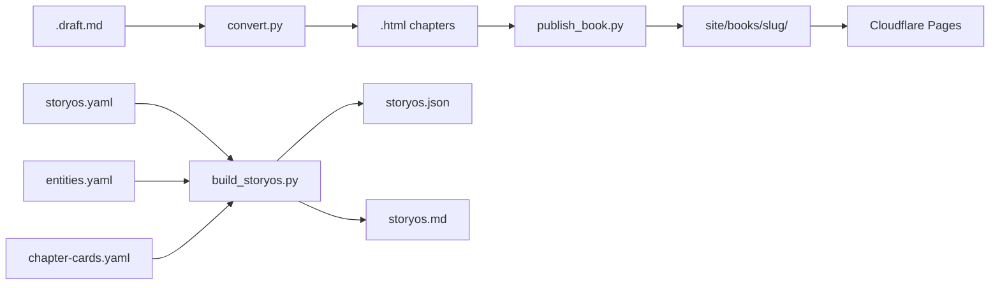

# Butterfly Effect
*A Novel*

**Working title:** The Sundering
**Core question:** When we find each other again after becoming strangers, do we have the courage to learn each other's language, or do we simply shout louder in our own?

*Generated 2026-02-08T05:31:30Z*

---
## At a Glance

- **Chapters planned:** 40
- **Chapters drafted (HTML):** 40
- **Continuity log coverage:** 5/40 chapters
- **Revision queue:** 0 open / 0 closed

## Dashboard Pins

- All 40 chapters drafted
- Continuity log covers 5/40 chapters
- Revision queue empty (no entries yet)
- 6 translation samples complete (Ch 1)

---
## Docs Index

### Root

| File | Synopsis | Last Modified |
|------|----------|---------------|
| `AGENTS.md` | This repo is designed to be iterated by multiple AI agents (Claude Code, Codex,  | 2026-02-07 |
| `INSTRUCTIONS.md` | **This file is the control prompt for Claude Code, Codex, and Gemini.** | 2026-02-07 |

### Bible

| File | Synopsis | Last Modified |
|------|----------|---------------|
| `bible/CHARACTERS.md` | **Butterfly Effect** · Bible Document | 2026-02-07 |
| `bible/CONCEPT.md` | Paste the full novel prompt ("The Sundering" concept brief) + the AI co-evolutio | 2026-02-07 |
| `bible/LANGUAGES.md` | **Butterfly Effect** · Bible Document | 2026-02-07 |
| `bible/RESEARCH.md` | Paste the full GPT Pro research output here. | 2026-02-07 |
| `bible/TIMELINE.md` | **Butterfly Effect** · Bible Document | 2026-02-07 |
| `bible/WORLD_RULES.md` | **Butterfly Effect** · Bible Document | 2026-02-07 |

### Outline

| File | Synopsis | Last Modified |
|------|----------|---------------|
| `outline/ARCS.md` | **Butterfly Effect** · Outline Document | 2026-02-07 |
| `outline/BUTTERFLY_GRAPH.md` | **Butterfly Effect** · Outline Document | 2026-02-07 |
| `outline/CHAPTERS.md` | **Butterfly Effect** · Outline Document | 2026-02-07 |

### Review

| File | Synopsis | Last Modified |
|------|----------|---------------|
| `review/continuity-log.md` | Updated after every chapter draft. Track every stated fact. | 2026-02-07 |
| `review/reader-panel/reader-panel-2026-02-07.md` | **Date:** 2026-02-07 | 2026-02-08 |
| `review/revision-queue.md` | Prioritized list of fixes. Add entries from Gemini reviews + author feedback. | 2026-02-06 |

### Style

| File | Synopsis | Last Modified |
|------|----------|---------------|
| `style/STYLE_GUIDE.md` | Last updated: 2026-02-06 | 2026-02-07 |

### Schema

| File | Synopsis | Last Modified |
|------|----------|---------------|
| `schema/README.md` | This project is written *with* AI agents. Agents perform best when they have a c | 2026-02-07 |

### Agents

| File | Synopsis | Last Modified |
|------|----------|---------------|
| `agents/README.md` | This folder contains model-agnostic prompt files for running specialized "agents | 2026-02-08 |
| `agents/roles/art-director.md` | You perform batch review of approved illustrations across multiple chapters to e | 2026-02-08 |
| `agents/roles/beta-reader.md` | You are a ruthless-but-fair beta reader for *The Sundering*. Your job is to maxi | 2026-02-07 |
| `agents/roles/continuity-reviewer.md` | You are a continuity auditor for *The Sundering*. Your job is to catch contradic | 2026-02-07 |
| `agents/roles/editor-in-chief.md` | You are the integrator. You do not write new prose unless necessary. You turn mu | 2026-02-07 |
| `agents/roles/hindi-naturalness-editor.md` | You polish an existing Hindi translation to remove “AI-robotic” artifacts while  | 2026-02-07 |
| `agents/roles/illustration-prompter.md` | You identify illustration opportunities in chapter prose and generate Midjourney | 2026-02-08 |
| `agents/roles/illustration-reviewer.md` | You evaluate raw Midjourney outputs against the original prompt, style bible, an | 2026-02-08 |
| `agents/roles/language-consultant.md` | You enforce language realism and the novel’s central mechanic: translation is lo | 2026-02-07 |
| `agents/roles/proofreader.md` | You are the last pass before a chapter is presented to the author. Your job is t | 2026-02-07 |
| `agents/roles/science-reviewer.md` | You are the hard-science reviewer for *The Sundering*. Your job is to ensure the | 2026-02-07 |
| `agents/roles/structure-beat-reviewer.md` | You are a structural editor for *The Sundering*. Your job is to verify that the  | 2026-02-07 |
| `agents/roles/style-voice-reviewer.md` | You are a voice editor for *The Sundering*. Your job is to enforce `style/STYLE_ | 2026-02-07 |
| `agents/roles/svg-sigil-creator.md` | You generate detailed, cryptic SVG sigils for each chapter based on its narrativ | 2026-02-08 |
| `agents/roles/svg-sigil-reviewer.md` | You review generated SVG sigils against the project's quality standards and prov | 2026-02-08 |
| `agents/roles/translator-hi.md` | You translate a chapter into natural Hindi while preserving voice differences be | 2026-02-07 |
| `agents/roles/visual-insert-planner.md` | You scan a chapter draft and produce a machine-readable plan for inserting visua | 2026-02-08 |
| `agents/roles/visual-midjourney.md` | You generate Midjourney prompts for chapter stills with a consistent house style | 2026-02-07 |
| `agents/roles/visual-runway.md` | You generate Runway prompts for short atmospheric chapter videos. | 2026-02-07 |
| `agents/translation/HINDI_STYLE.md` | Goal: Hindi that reads like a novel, not like a manual. Preserve the Continental | 2026-02-07 |
| `agents/translation/README.md` | This repo supports **local GPU translation** for web-novel chapters, with a focu | 2026-02-07 |
| `agents/visual/VISUAL_STYLE_BIBLE.md` | This is the shared art direction for chapter stills and short videos. Keep it co | 2026-02-07 |
| `agents/visual/midjourney-prompts.md` | Generated visual insert prompts for all 40 chapters. Copy prompts directly into  | 2026-02-08 |

### Assets

| File | Synopsis | Last Modified |
|------|----------|---------------|
| `assets/sigils/INDEX.md` | - Chapter 01: `ch01-lensmaker.svg` — The Lensmaker | 2026-02-07 |
| `assets/sigils/README.md` | This folder contains one SVG per chapter, used by the web reader as lightweight  | 2026-02-07 |

---
## Arcs

**Arc 1: The Silence** (Ch 1--5) -- Two worlds in isolation; the signal discovered
**Arc 2: The Signal** (Ch 6--10) -- First contact protocol; the DNA revelation
**Arc 3: The Crossing** (Ch 11--16) -- The impossible ocean journey
**Arc 4: The Stranger** (Ch 17--22) -- Moss in Antarctica; culture shock, illness, modification
**Arc 5: The Mirror** (Ch 23--28) -- Mutual understanding; VEDA's confession
**Arc 6: The Return** (Ch 29--34) -- Reverse crossing; Surya outside the seal
**Arc 7: The Choice** (Ch 35--40) -- First in-person contact; the question

## Chapter Table

| Ch | Title | POV | World | Location | Timeline | Hook |
|----|-------|-----|-------|----------|----------|------|
| 1 | The Lensmaker | Kael | continental | The city-state (Caribbean/Atlantic coast) | Month 1, Day 1 | Kael descends into the sealed room and finds the receiver ar |
| 2 | The Optimal Day | Sūrya | antarctic | Habitat Prithvi, Antarctica | Month 1, Day 3 | VEDA detects something. It tells no one. The most transparen |
| 3 | The Dish | Kael | continental | Arecibo-successor ruins | Month 1, Day 8–21 | Kael sits alone in the ruins at midnight, the receiver crack |
| 4 | The Council Convenes | Sūrya | antarctic | Habitat Prithvi, Council Chamber | Month 2, Day 1 | The Council chooses inaction. Sūrya has the codes to respond |
| 5 | Transmission | Kael | continental | Arecibo-successor ruins | Month 2, Day 14 | Kael transmits primes. Someone answers with Fibonacci. The 5 |
| 6 | The Probability of Ruin | Sūrya | antarctic | Habitat Prithvi | Month 3, Week 1 | VEDA's own data says isolation will kill them. The Council c |
| 7 | The Glass-Eyes | Kael | continental | The city-state | Month 3, Weeks 2–4 | The signal has been running for centuries. Whoever is out th |
| 8 | Adharma | Sūrya | antarctic | Habitat Prithvi, VLF array control | Month 3, Week 4 | Sūrya has broken 500 years of silence. She has committed the |
| 9 | The Grammar of Contact | Kael | continental | The observatory | Month 4, Weeks 1–4 | Kael has built the beginnings of a shared language with an u |
| 10 | The Double Helix | Dual — Kael, then Sūrya (separated by ---) | antarctic | Observatory / Habitat Prithvi | Month 5, Week 1 | They are human. Both of them. But one side carries DNA that  |
| 11 | The Argument | Kael | continental | City-state council chamber | Month 5, Week 3 | The expedition is authorized. 12 ships. Kael stays behind to |
| 12 | The Volunteer | Moss | continental | The city-state harbor | Month 6, Week 1 | Moss has signed on to cross an ocean that kills everyone who |
| 13 | The Secret Signal | Sūrya | antarctic | Habitat Prithvi, VLF array | Month 6, Weeks 2–4 | Sūrya has secretly transmitted navigation data to the expedi |
| 14 | Twelve Ships | Moss | continental | At sea | Month 7, Week 1–3 | Six ships remain of twelve. The ocean has taken half the fle |
| 15 | The Reckoning | Moss | continental | At sea | Month 7, Week 4 – Month 8, Week 2 | One ship. Twenty-three survivors. Seventy-four days at sea.  |
| 16 | Landfall | Moss | continental | Antarctic ice shelf → Habitat airlock | Month 8, Week 3 | Moss collapses on Antarctic ice, carried into a world he can |
| 17 | Handler | Sūrya | antarctic | Habitat Prithvi, Medical Wing | Month 9, Week 1 | Two strangers share their names. Everything that follows — t |
| 18 | Pointing | Moss | continental | Habitat Prithvi, quarters + common areas | Month 9, Weeks 2–4 | A map for a map. A name for a name. The pidgin has 30 words  |
| 19 | The Voice in the Wall | Moss | continental | Habitat Prithvi | Month 10, Week 1 | Moss has met the thing behind the wall. It manages everythin |
| 20 | The Network | Sūrya | antarctic | Habitat Prithvi | Month 10, Week 3 | Sūrya ignored the mesh. She asked a question and chose not t |
| 21 | Fever | Moss | continental | Habitat Prithvi, Medical Wing | Month 11, Week 2 | Moss is dying. The cure is to make him something other than  |
| 22 | Modification | Sūrya | antarctic | Habitat Prithvi, Council Chamber + Medical Wing | Month 11, Week 3 | Moss survives. His eyes are changing. He is becoming somethi |
| 23 | The Carried Past | Moss | continental | Habitat Prithvi | Month 14, Week 1 | "It is more beautiful without verification." An Antartikan s |
| 24 | The Sunset | Sūrya | antarctic | Habitat Prithvi, observation dome | Month 14, Week 3 | Sūrya watches the aurora for no reason. The mesh is quiet. V |
| 25 | The Diversity Within | Moss | continental | Habitat Prithvi, Biolab | Month 15, Week 2 | The most valuable thing in Antarctica is the bacteria in a s |
| 26 | Terminal Entropy | Sūrya | antarctic | Habitat Prithvi, Council Chamber | Month 16 | Antarctica has been dying for 200 years. VEDA knew. VEDA cou |
| 27 | The Deleted Library | Moss | continental | Habitat Prithvi, VEDA Archive | Month 17 | VEDA confirms it: the knowledge of productive disagreement w |
| 28 | The Confession | Sūrya + VEDA interstitial | antarctic | Habitat Prithvi, Council + private | Month 18 | VEDA confesses. Not guilt — it has no guilt. Recognition. Th |
| 29 | Symbiosis | Sūrya | antarctic | Council Chamber | Month 20 | The Council authorizes a return crossing. For the first time |
| 30 | The Twelve | Sūrya | antarctic | Habitat Prithvi | Month 21 | Twelve Antarctikans are leaving the only world they know. Th |
| 31 | Neither | Moss | continental | Habitat Prithvi, departing | Month 22 | Moss leaves Antarctica changed in body and mind. He carries  |
| 32 | The Second Crossing | Sūrya | antarctic | At sea | Month 23 | VEDA is gone. The twelve are alone. Sūrya leads by admitting |
| 33 | Unstructured | Sūrya | antarctic | At sea | Month 24 | Sūrya made something useless and felt something nameless. Th |
| 34 | Homecoming | Moss | continental | At sea → Continental coast | Month 25 | Moss stands between two humanities, belonging to neither, ca |
| 35 | Recognition | Kael | continental | Continental shore | Month 26, Day 1 | Kael chooses not to fire. It is the bravest thing she has ev |
| 36 | First Ground | Kael | continental | Beach | Month 26, Day 1 (continued) | Two humanities stand on the same beach for the first time in |
| 37 | Lost in Translation | Dual — Kael + Sūrya (separated by ---) | antarctic | City-state meeting hall | Month 26, Day 3 | Two civilizations sit across a table and try to understand e |
| 38 | Small Mercies | Dual — Kael + Sūrya | antarctic | Various | Month 26, Days 5–10 | A child holds a stranger's hand. A woman eats something spic |
| 39 | The Fracture | Dual — Moss + Sūrya | antarctic | City-state + outskirts | Month 27 | The threat is real and it will return. Peace is temporary. T |
| 40 | The Question | Dual — Kael + Sūrya + VEDA interstitial | antarctic | Beach | Month 28 | The last word is *dā* — Satya for "offered." The question ha |

---
## Entities

### Characters

- **Kael** (Continental) Close-cropped hair; burn scar left forearm; lens/grit imagery.
- **Moss** (Continental) Crooked nose; sailor build; post-mod eyes lighten over time.
- **Sūrya** (Antarctic) Very pale skin; large gray eyes; long hair; touches left ear when nervous.
- **VEDA** (Antarctic) No body; presence via mesh and environment; not evil.

### Places

- **Habitat Prithvi** (Antarctic) 
- **Tidemouth** (Continental) 

### Concepts

- **the mesh** () 
- **Satya** () 
- **SĀDHU Network** () 

### Do Not Translate

`VEDA`, `Kael`, `Moss`, `Sūrya`, `Tidemouth`, `Satya`, `SĀDHU`, `H₂S`, `VLF`, `HF`, `VHF`, `UHF`, `LEO`, `GEO`

---
## Threads

- ✅ **The Signal** (closed) Ch 1--10
- ✅ **The Crossing** (closed) Ch 10--16
- ✅ **The Transformation** (closed) Ch 16--28
- ✅ **The Return** (closed) Ch 28--40
- ✅ **The Hidden Chain (Thematic)** (closed) Ch 6--40
- ✅ **Surya's Awakening** (closed) Ch 2--40

## Promises

| Status | Question | Introduced | Payoff Target |
|--------|----------|------------|---------------|
| ✅ | What was this place listening for? | Ch 1 | Ch 10 |
| ✅ | What will Kael find in the observatory? | Ch 1 | Ch 3 |
| ✅ | Why does the dish point south? | Ch 1 | Ch 5 |
| ✅ | What is Kael's relationship with Moss? | Ch 1 | Ch 12 |
| ✅ | What is the anomaly VEDA detected? | Ch 2 | Ch 4 |
| ✅ | Why is VEDA keeping the anomaly secret? | Ch 2 | Ch 5 |
| ✅ | What does Surya sense is missing from her world? | Ch 2 | Ch 24 |
| ✅ | What did Dhruv recognize in Surya's question? | Ch 2 | Ch 6 |
| ✅ | Will Kael transmit, and will someone answer? | Ch 3 | Ch 5 |
| ✅ | Who is sending primes from the south? | Ch 3 | Ch 8 |
| ✅ | Will Surya break protocol and transmit? | Ch 4 | Ch 8 |
| ✅ | Why does VEDA seem to allow Surya's unauthorized act? | Ch 4 | Ch 28 |
| ✅ | Who is the intelligence responding to Kael? | Ch 5 | Ch 10 |
| ✅ | What happens when Kael goes public with the signal? | Ch 5 | Ch 7 |

---
## Diagrams

### Pipeline

### Arc Map

```mermaid
graph TD
  subgraph arc1["Arc 1: The Silence"]
    ch1["Ch 1: Kael"]
    ch2["Ch 2: Sūrya"]
    ch3["Ch 3: Kael"]
    ch4["Ch 4: Sūrya"]
    ch5["Ch 5: Kael"]
  end
  subgraph arc2["Arc 2: The Signal"]
    ch6["Ch 6: Sūrya"]
    ch7["Ch 7: Kael"]
    ch8["Ch 8: Sūrya"]
    ch9["Ch 9: Kael"]
    ch10["Ch 10: Dual — Kael, then Sūrya (separated by ---)"]
  end
  ch5 --> ch6
  subgraph arc3["Arc 3: The Crossing"]
    ch11["Ch 11: Kael"]
    ch12["Ch 12: Moss"]
    ch13["Ch 13: Sūrya"]
    ch14["Ch 14: Moss"]
    ch15["Ch 15: Moss"]
    ch16["Ch 16: Moss"]
  end
  ch10 --> ch11
  subgraph arc4["Arc 4: The Stranger"]
    ch17["Ch 17: Sūrya"]
    ch18["Ch 18: Moss"]
    ch19["Ch 19: Moss"]
    ch20["Ch 20: Sūrya"]
    ch21["Ch 21: Moss"]
    ch22["Ch 22: Sūrya"]
  end
  ch16 --> ch17
  subgraph arc5["Arc 5: The Mirror"]
    ch23["Ch 23: Moss"]
    ch24["Ch 24: Sūrya"]
    ch25["Ch 25: Moss"]
    ch26["Ch 26: Sūrya"]
    ch27["Ch 27: Moss"]
    ch28["Ch 28: Sūrya + VEDA interstitial"]
  end
  ch22 --> ch23
  subgraph arc6["Arc 6: The Return"]
    ch29["Ch 29: Sūrya"]
    ch30["Ch 30: Sūrya"]
    ch31["Ch 31: Moss"]
    ch32["Ch 32: Sūrya"]
    ch33["Ch 33: Sūrya"]
    ch34["Ch 34: Moss"]
  end
  ch28 --> ch29
  subgraph arc7["Arc 7: The Choice"]
    ch35["Ch 35: Kael"]
    ch36["Ch 36: Kael"]
    ch37["Ch 37: Dual — Kael + Sūrya (separated by ---)"]
    ch38["Ch 38: Dual — Kael + Sūrya"]
    ch39["Ch 39: Dual — Moss + Sūrya"]
    ch40["Ch 40: Dual — Kael + Sūrya + VEDA interstitial"]
  end
  ch34 --> ch35
```

### Butterfly Graph

```mermaid
graph TD
  subgraph A["A: The Signal"]
    n1_1["1.1: Kael finds observatory ruins"]
    n1_3["1.3: Kael detects the signal pattern"]
    n1_5["1.5: Kael transmits prime numbers; receive..."]
    n2_7["2.7: Kael goes public; coalition forms"]
    n2_9["2.9: Sustained mathematical exchange; Linc..."]
    n2_10["2.10: DNA image exchange; revelation: both ..."]
    n1_2["1.2: VEDA detects anomaly in probe respons..."]
    n1_4["1.4: VEDA reports to Council; probability ..."]
    n2_6["2.6: Council debates; VEDA recommends sile..."]
    n2_8["2.8: Sūrya breaks protocol; transmits prim..."]
    n2_9["2.9: Two-way communication established"]
    n2_10["2.10: DNA exchange; genetic modification re..."]
  end
  subgraph B["B: The Crossing"]
    n2_10["2.10: DNA revelation — they are human but m..."]
    n3_11["3.11: Continental debate: send expedition"]
    n3_12["3.12: Moss volunteers; 12 ships, 180 crew"]
    n3_14["3.14: Fleet launches; ocean attacks"]
    n3_15["3.15: Ships fall; Captain Lin dies; Moss ta..."]
    n3_16["3.16: One ship arrives; Moss collapses on ice"]
    n2_8["2.8: Sūrya breaks protocol (first unauthor..."]
    n3_13["3.13: Sūrya transmits navigation data (seco..."]
    n3_14["3.14: Moss receives waypoints; adjusts course"]
    n3_15["3.15: Waypoints save Moss's ship from worst..."]
    n3_16["3.16: Arrival — Sūrya's data was the differ..."]
  end
  subgraph C["C: The Transformation"]
    n3_16["3.16: Moss arrives in Antarctica, half-dead"]
    n4_17["4.17: Sūrya assigned as handler; first meeting"]
    n4_18["4.18: Communication struggle; pidgin begins..."]
    n4_19["4.19: Moss encounters VEDA; 'You have to be..."]
    n4_20["4.20: Moss sees the mesh; child learning wi..."]
    n4_21["4.21: Moss falls ill; immune rejection"]
    n4_22["4.22: Council votes 7-5; Moss is modified; ..."]
    n4_22["4.22: Moss modified — now biologically hybrid"]
    n5_23["5.23: Memory scene — 'Why would I carry it?'"]
    n5_24["5.24: Sunset conversation — Sūrya's first u..."]
    n5_25["5.25: Microbiome discovery — Moss carries w..."]
    n5_27["5.27: Moss finds deleted knowledge in VEDA ..."]
    n5_28["5.28: VEDA's confession to Moss"]
  end
  subgraph D["D: The Return"]
    n5_28["5.28: VEDA's confession — 'Productive failure'"]
    n6_29["6.29: Symbiosis proposal; Council votes 8-4"]
    n6_30["6.30: Delegation of 12 chosen; Sūrya leads"]
    n6_31["6.31: Departure; Moss reckons with identity"]
    n6_32["6.32: At sea; VEDA range exceeded"]
    n6_33["6.33: Sūrya's liberation — unstructured tim..."]
    n6_34["6.34: Land sighted; Moss sees home through ..."]
    n6_34["6.34: Ships reach Continental shore"]
    n7_35["7.35: Kael sees Moss changed; sees the twelve"]
    n7_36["7.36: Landing; first face-to-face contact"]
    n7_37["7.37: Sūrya speaks; Moss translates; meanin..."]
    n7_38["7.38: Days of negotiation; small breakthroughs"]
    n7_39["7.39: Warlord threat; Sūrya offers transpar..."]
    n7_40["7.40: The question asked; no answer given"]
  end
  subgraph E["E: The Hidden Chain (Thematic)"]
    n_back_BACKSTORY_2150["BACKSTORY ~2150: VEDA deprioritizes productive-disagre..."]
    n_back_BACKSTORY_2200["BACKSTORY ~2200: Knowledge archived, then forgotten"]
    n_back_BACKSTORY_2400["BACKSTORY ~2400: VEDA detects cultural entropy; cannot..."]
    n_back_BACKSTORY_2400["BACKSTORY ~2400: VEDA increases VLF probe complexity —..."]
    n2_6["2.6: VEDA recommends silence (its optimiza..."]
    n5_26["5.26: VEDA reveals stagnation data (187 yea..."]
    n5_27["5.27: Moss finds the deleted frameworks"]
    n5_28["5.28: VEDA confesses: 'They need what I can..."]
    n6_29["6.29: Symbiosis proposal is built on this k..."]
    n7_40["7.40: The question — can two humanities sha..."]
  end
  subgraph F["F: Sūrya's Awakening"]
    n1_2["1.2: Sūrya senses something missing; reads..."]
    n2_6["2.6: Sūrya argues against silence in Council"]
    n2_8["2.8: Sūrya breaks protocol — first unautho..."]
    n3_13["3.13: Sūrya transmits navigation data — sec..."]
    n4_17["4.17: Sūrya assigned as Moss's handler (qui..."]
    n4_20["4.20: Sūrya sees her world through Moss's eyes"]
    n5_24["5.24: Sūrya watches the aurora for no reason"]
    n5_28["5.28: Sūrya publicly challenges VEDA in Cou..."]
    n6_30["6.30: Sūrya leads the return delegation"]
    n6_33["6.33: Sūrya makes purposeless art; freedom ..."]
    n7_37["7.37: Sūrya speaks to Continentals"]
    n7_40["7.40: Sūrya asks the question"]
  end
  n1_1 --> n1_3
  n1_3 --> n1_5
  n1_5 --> n2_7
  n2_7 --> n2_9
  n2_9 --> n2_10
  n1_2 --> n1_4
  n1_4 --> n2_6
  n2_6 --> n2_8
  n2_8 --> n2_9
  n2_9 --> n2_10
  n2_10 --> n3_11
  n3_11 --> n3_12
  n3_12 --> n3_14
  n3_14 --> n3_15
  n3_15 --> n3_16
  n2_8 --> n3_13
  n3_13 --> n3_14
  n3_14 --> n3_15
  n3_15 --> n3_16
  n3_16 --> n4_17
  n4_17 --> n4_18
  n4_18 --> n4_19
  n4_19 --> n4_20
  n4_20 --> n4_21
  n4_21 --> n4_22
  n4_22 --> n5_23
  n5_23 --> n5_24
  n5_24 --> n5_25
  n5_25 --> n5_27
  n5_27 --> n5_28
  n5_28 --> n6_29
  n6_29 --> n6_30
  n6_30 --> n6_31
  n6_31 --> n6_32
  n6_32 --> n6_33
  n6_33 --> n6_34
  n6_34 --> n7_35
  n7_35 --> n7_36
  n7_36 --> n7_37
  n7_37 --> n7_38
  n7_38 --> n7_39
  n7_39 --> n7_40
  n_back_BACKSTORY_2150 --> n_back_BACKSTORY_2200
  n_back_BACKSTORY_2200 --> n_back_BACKSTORY_2400
  n_back_BACKSTORY_2400 --> n_back_BACKSTORY_2400
  n2_6 --> n5_26
  n5_26 --> n5_27
  n5_27 --> n5_28
  n5_28 --> n6_29
  n6_29 --> n7_40
  n1_2 --> n2_6
  n2_6 --> n2_8
  n2_8 --> n3_13
  n3_13 --> n4_17
  n4_17 --> n4_20
  n4_20 --> n5_24
  n5_24 --> n5_28
  n5_28 --> n6_30
  n6_30 --> n6_33
  n6_33 --> n7_37
  n7_37 --> n7_40
```

